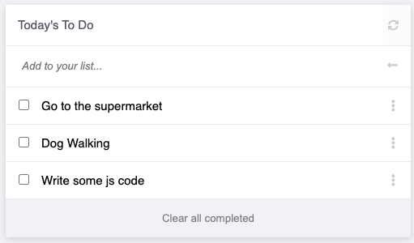

# To Do Task List

> In this project, I have set up a To Do Tasks list using webpack.

## Built With

- HTML - CSS - JavaScript - Webpack
- Git - Github - GitFlow

## Getting Started

To get a local copy up and running follow these simple example steps.

### Prerequisites

- Visual Studio Code or Sublime Text
- Git
- LiveServer Extension

### Setup

Go to the top of the page, press te green button that says "Code", and copy the link. Then you have to go to your console and type " git clone 'repository-url.com' ".

That's all, you are ready to go!

### Install

No extra dependencies needed to use the code!

### Usage

Add Live Server VSCode extension to deploy a local host server in order to start using it!

### Live Demo Server

- [To Do Tasks List](https://ramiaquista.github.io/todo-list/)

## Authors

👤 **Author : Ramiro Aquistapace**

- GitHub: [@ramiaquista](https://github.com/ramiaquista)
- Twitter: [@ramiaq1](https://twitter.com/ramiaq1)
- LinkedIn: [RamiroAquistapace](https://www.linkedin.com/in/ramiro-aquistapace-32b61b204/)

## 🤝 Contributing

Contributions, issues, and feature requests are welcome!

## Show your support

Give a ⭐️ if you like this project! 😄
